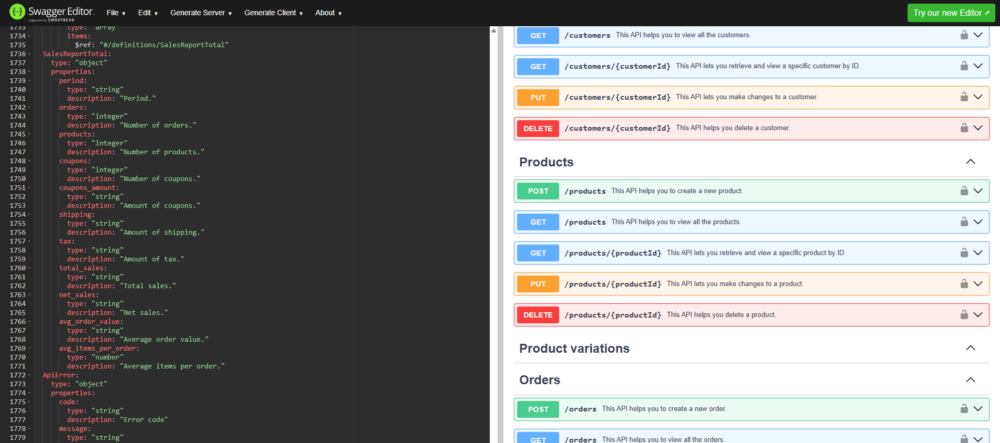

# WooCommerce REST API specification in Swagger 2.0 format

The WooCommerce REST API specification in Swagger 2.0 format.

## 🚨 Project Status

> ⚠️ **Note: This is a development version!**
> 
> The specification is under development and will be gradually expanded to cover the key functionalities of the commerce engine.

## 📦 Version Information

- **Current Version**: `0.9.5`
- **Swagger Specification Version**: `2.0`
- **Supported WooCommerce API Version**: `v3`

## 🔓 License

**MIT License**

Permission is hereby granted, free of charge, to any person obtaining a copy of this software and associated documentation files, to use, copy, modify, merge, publish, distribute, sublicense, and/or sell copies of the software.

The only requirement is to preserve the original author attribution in the source code and documentation.

## 🔍 Quick Glance at the API in Swagger

You can take a quick look at the API in Swagger [here](https://editor.swagger.io/?url=https://raw.githubusercontent.com/wtx-labs/woocommerce-api-swagger-specification/main/woocommerce-rest-api-swagger-specification.yml).

## 🚀 WooCommerce REST API Client for Java

Are you looking to seamlessly integrate your Java applications with WooCommerce? Look no further! Our [WooCommerce REST API Client for Java](https://github.com/wtx-labs/woocommerce-api-client-java) is designed to make your integration process smooth and efficient. Try it and give us your feedback!

## 🔗 Stay Connected

✨ We're constantly improving this specification!
💡 Have suggestions or need help?
- [Report a Bug](https://github.com/wtx-labs/woocommerce-api-swagger-specification/issues/new?template=bug_report.yml)
- [Request a Feature](https://github.com/wtx-labs/woocommerce-api-swagger-specification/issues/new?template=feature_request.yml)
- [Improve Documentation](https://github.com/wtx-labs/woocommerce-api-swagger-specification/issues/new?template=documentation_issue.yml)

🚀 Happy coding! 😊

**Your WTX Labs Team** 🚀